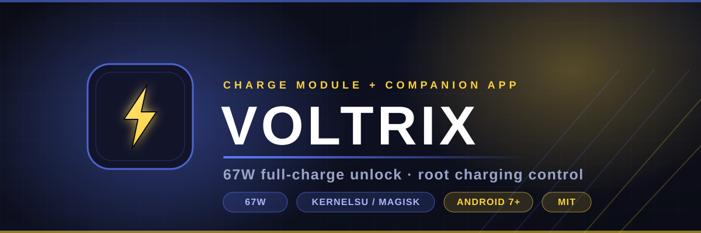
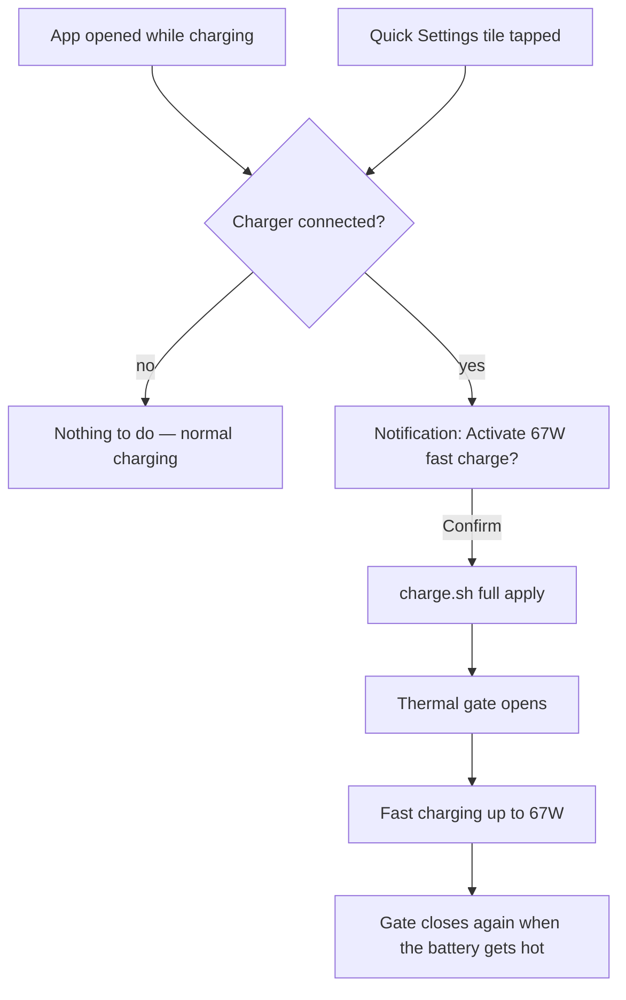

  

<h1 align="center">VOLTRIX</h1>

  <strong>67W full-charge unlock and root-level charging control for Xiaomi / Qualcomm devices.</strong>

  
  
  
  

---

VOLTRIX is a Magisk / KernelSU module plus a companion Android app. It takes over the charging path on rooted Xiaomi phones with Qualcomm SoCs: profiles are guaranteed to apply at boot, Xiaomi's charging throttles are switched off, and a thermal gate opens or closes on temperature — so fast charging works without you opening anything.

## Highlights

- **67W full-charge unlock** — open the app while charging or tap the Quick Settings tile, confirm one notification, and the module applies a full fast-charge profile.
- **Guaranteed boot-time apply** — `balanced`, `performance` and `battery_saver` profiles are written at every boot via `charge_control_limit` and `constant_charge_current`.
- **Xiaomi throttles disabled** — night charging, `smart_chg` and `restrict_chg` are turned off so the vendor daemon cannot walk your charge rate back.
- **Thermal gate with hysteresis** — the thermal limit is removed below `THERMAL_COOL_C` (40 °C) and restored above `THERMAL_HOT_C` (45 °C), so it never flaps at one threshold.
- **Optional always-fast mode** — `ALWAYS_FAST` applies the full profile with no prompt.
- **Charge limit** — stop charging at a chosen percentage, enforced through `input_suspend`.
- **Adaptive charger-connect watcher** — notices plug-in events and re-applies the active profile.
- **Everything from the app** — profile, thermal toggle and temperature range, performance level 0–16, performance current, always-fast, charge limit and a log viewer.
- **Degrades gracefully** — devices without the `qcom-battery` nodes still install and run; only the missing knobs are skipped.

## 67W unlock flow

## Settings you control

Every key below lives in `/data/adb/vnerxy_charge/config.sh`; the companion app reads and writes them, and `charge.sh` applies them on boot and on every charger event.

| Config key | Effect |
| --- | --- |
| `PROFILE` | Active charging profile: `balanced`, `performance` or `battery_saver`. |
| `PERFORMANCE_LEVEL` | Charge level written to `charge_control_limit` for the performance profile (0–16). |
| `PERFORMANCE_MA` | Value written to `constant_charge_current` for the performance profile, in mA. |
| `DISABLE_THERMAL` | When `true`, the Xiaomi thermal charge limit is removed instead of enforced. |
| `THERMAL_HOT_C` | Battery temperature (°C) at which the thermal limit is restored — default `45`. |
| `THERMAL_COOL_C` | Battery temperature (°C) at which the thermal limit is removed — default `40`. |
| `ALWAYS_FAST` | When `true`, the full fast-charge profile is applied automatically, with no confirmation prompt. |
| `CHARGE_LIMIT` | Stop charging at this battery percentage (`0` disables the limit); enforced through `input_suspend`. |
| `DISABLE_NIGHT_CHARGING` / `DISABLE_SMART_CHG` / `DISABLE_RESTRICT` | Switch off Xiaomi's night charging, smart charging and restriction throttles. |
| `AUTO_TRIGGER_ENABLED` | Enables the adaptive charger-connect watcher that re-applies the profile when you plug in. |

## Install

1. Download the **VOLTRIX** zip from the [Releases](https://github.com/a2z05/VOLTRIX/releases) page.
2. Flash it in **KernelSU** or **Magisk**.
3. Reboot — the module applies your profile at boot and auto-installs the companion app from the zip (`pm install`).
4. Open KernelSU or Magisk once and **grant root to the VOLTRIX app**.
5. Open the app, pick a profile, and charge.

> CI builds the app APK, injects it into the module zip, and attaches both the zip and the APK to each GitHub Release.

## Requirements

- **KernelSU** or **Magisk**
- **Android 7+**
- A **Xiaomi device with a Qualcomm SoC** exposing the `qcom-battery` sysfs nodes

Devices missing those nodes install cleanly and degrade gracefully — the affected settings are simply skipped instead of failing.

## Uninstall

Remove the module from KernelSU / Magisk (or drop a `remove` file in the module folder) and reboot. The app can then be uninstalled like any other app. Nothing outside `/data/adb/vnerxy_charge/` is touched.

## Credits

Crafted by **a2z (Vnerxy)** — [github.com/a2z05/VOLTRIX](https://github.com/a2z05/VOLTRIX)

## License

This project is licensed under the [MIT License](LICENSE).
